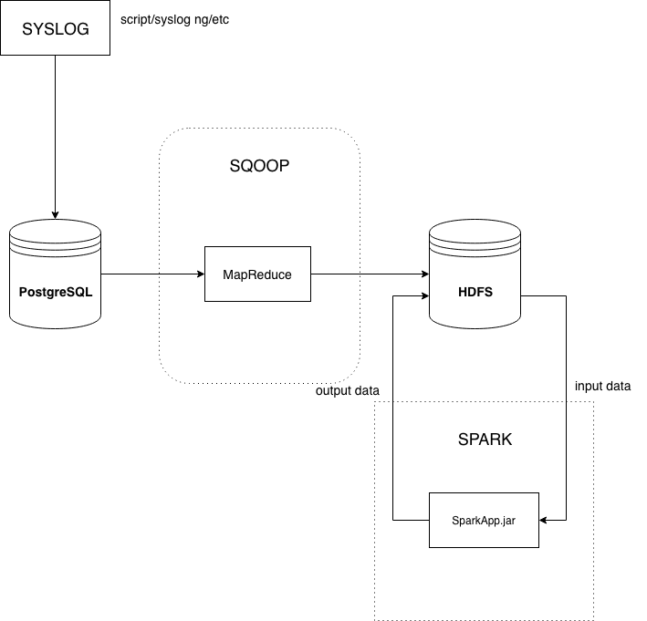

## Как запустить приложение

На хосте должен быть установлен maven
    
    cd /opt
    wget https://www-eu.apache.org/dist/maven/maven-3/3.6.3/binaries/apache-maven-3.6.3-bin.tar.gz
    tar xzf apache-maven-3.6.3-bin.tar.gz
    ln -s apache-maven-3.6.3 maven
    vi /etc/profile.d/maven.sh
    С содержимым
    export M2_HOME=/opt/maven
    export PATH=${M2_HOME}/bin:${PATH}

### Собираем проект
`mvn clean package`

### Собираем контейнеры
`docker compose build`

### Запускаем контейнеры
`docker compose up`

### Cхема взаимодействия компонентов

